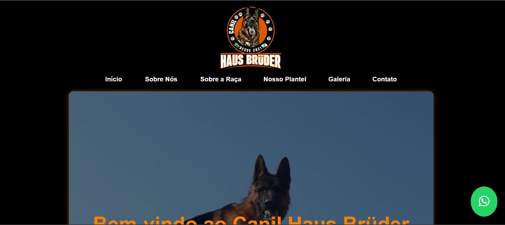

# 🐶 Site Canil Haus Bruder

## 📖 Sobre
Este projeto é um site institucional desenvolvido para apresentar um canil, com informações sobre os cães, galeria de fotos e formas de contato.

## 🛠 Tecnologias
- HTML5
- CSS3

## 🎯 Funcionalidades
- Exibição de informações sobre o canil  
- Apresentação dos cães  
- Galeria de fotos de cães e filhotes  
- Layout responsivo  
- Contato via botão de WhatsApp  

## ▶️ Como executar
Abra o arquivo `index.html` no navegador

## 📷 Preview

## 🔗 Acesse o projeto
https://alexandrelemosdev.github.io/site-canil-haus-bruder/

## 📚 Aprendizados
Neste projeto foram aplicados conceitos de HTML, CSS e responsividade no desenvolvimento de páginas web.
